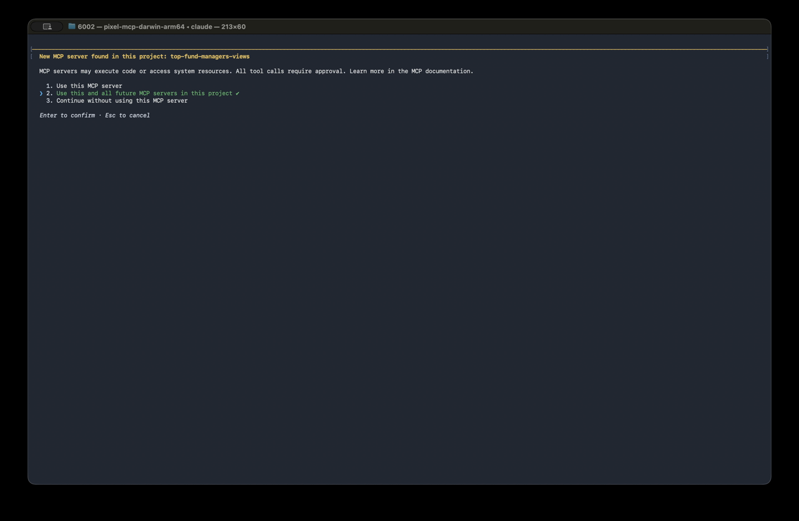
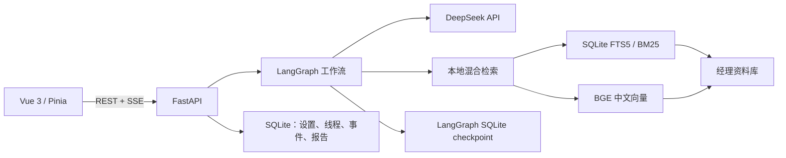

# 🔎 中国顶流基金经理观点库 — 张坤 · 谢治宇 · 高楠 · 刘旭 · 张璐 · 赵诣

**可溯源 · 原文为据 · 三位一体 · 跨 AI 平台 · 可封装为 MCP Server**

> 「查观点 · 学方法 · 做前瞻 · 仿口吻写点评 · 言行对照 · 多经理横向对比 · 全市场基金对比与评分 —— 让任意 AI 读懂中国最热门的六位基金经理」

| 标签 | 内容 |
|---|---|
| License | MIT |
| 类型 | Agent Skill / 可安装 Python 包 / 标准 MCP Server / 本机 Web 应用（Fund Insight） |
| 数据 | 真实公开披露（可溯源到原文） |
| 基金经理 | 张坤（易方达）· 谢治宇（兴证全球）· 高楠（永赢）· 刘旭（大成）· 张璐（永赢）· 赵诣（泉果） |
| 基金覆盖 | 六位经理全部在任 + 曾任基金 + 全市场约 2.7 万只 |
| 平台 | Claude · WorkBuddy · ChatGPT · Gemini · Cursor · 任意 MCP 客户端 · 纯命令行 · Fund Insight Web 界面 |

### 🎬 演示视频

> 本仓库把基金经理观点库**主能力封装为 MCP Server**，同时附带本机 Web 模块 Fund Insight；两种形态共用同一份语料与逻辑。下方视频可直接在 GitHub 页面内播放。

**🔌 MCP Server 演示**（Claude Code / Cursor / 任意 MCP 客户端 — 根模块主能力）




**🌐 Fund Insight（Web 模块）演示**

[](web/demo/demo.mp4)

> **⚠️ 合规与免责（必读）**：本库仅限**个人研究 / 学习辅助**使用。我们**不保证**所收录数据的准确性、完整性、及时性；**不承诺任何收益、不保证盈利、不构成投资建议**；**禁止私自传播、转售或用于任何商业 / 合规敏感用途**。转载或衍生请保留署名与出处，并遵守各数据来源方（基金公司、媒体、数据商）的使用条款。使用即表示你已理解并同意上述条款。

---

## 📑 目录

- [一、这是什么](#一这是什么)
- [二、为什么是这六位](#二为什么是这六位)
- [三、三块根基](#三三块根基全部来自公开内容可溯源)
- [四、核心能力一览](#四核心能力一览)
- [五、快速开始](#五快速开始)
- [六、项目结构](#六项目结构)
- [七、作为 MCP Server 运行](#七作为-mcp-server-运行)
- [八、工具 / 命令详解](#八工具--命令详解)
- [九、脚本速查](#九脚本速查)
- [十、扩展指南](#十扩展指南)
- [十一、组合工作流：用现有命令完成你自己的标的分析](#十一组合工作流用现有命令完成你自己的标的分析)
- [十二、数据来源与真实性](#十二数据来源与真实性)
- [十三、合规、边界与限制](#十三合规边界与限制)
- [十四、常见问题（FAQ）](#十四常见问题faq)
- [十五、相关文档与更新日志](#十五相关文档与更新日志)
- [十六、License](#十六license)
- [十七、Web 模块（Fund Insight）](#十七web-模块fund-insight)

---

## 一、这是什么

这是一个**把中国顶流公募基金经理的公开观点「结构化、可溯源、可复用」的知识库**，同时是一套**标准 MCP Server + 命令行工具**。它让任意支持 MCP 的 AI 客户端（或纯命令行）能够：

- 准确回答「某经理对某方向怎么看」，并**附上他本人原话出处**；
- 用「有原话佐证的」方法框架解释某经理的选股/风控逻辑；
- 在语料没直接谈过的话题上，**用他的方法推演**（并声明非本人观点）；
- 把「他说过的话」与「真实逐季持仓 / 净值业绩」做言行对照；
- 跨六位经理做横向对比，或与全市场约 2.7 万只基金做对比、用某经理框架打分。

整个项目遵循**三层架构**：`references/`（数据）→ `src/.../core/`（纯逻辑，返回字符串）→ `server.py` / `cli.py`（接口层）。逻辑与接口解耦，因此 **MCP 工具与 CLI 子命令共用同一份实现、输出完全一致**，新增一位经理**零代码改动即被全部工具识别**。

此外，本项目还提供一个本机 Web 应用 **Fund Insight**（见第十七节），把上述检索 / 对比 / 评分能力以图形界面与多人讨论工作流呈现，适合不想写命令的用户。

> **⚠️ 仅供研究与学习辅助，不构成任何投资建议。**

---

## 二、为什么是这六位？

截至 2025 年底 / 2026 年初，以下六位代表了中国公募基金行业不同维度的「最热」：

| 基金经理 | 公司 | 管理规模 | 代表作 | 2025 年业绩 | 入选理由 |
|---|---|---|---|---|---|
| **张坤** | 易方达基金 | 483.83 亿 | 易方达蓝筹精选(005827) | 14.18% | 长期知名度最高的价值投资顶流，「消费一哥」 |
| **谢治宇** | 兴证全球基金 | 345.19 亿 | 兴全合润(163406) | 35.72% | 13 年任职回报超 10 倍，均衡成长长期标杆 |
| **高楠** | 永赢基金 | 701.05 亿 | 永赢睿信(019431) | 92.30% | 全市场管理规模最大主动基金经理，2 年 4 只翻倍基 |
| **刘旭** | 大成基金 | 约 265 亿 | 大成高鑫股票A(000628) | — | 低换手、高集中、长期持有的深度价值代表 |
| **张璐** | 永赢基金 | — | 永赢先进制造智选混合发起A(018124) | — | Beta 大通道风格、聚焦高端制造 / 半导体 |
| **赵诣** | 泉果基金（原农银汇理） | — | 农银汇理研究精选混合(000336) | — | 长坡厚雪、高端制造成长投资 |

> **⚠️ 仅供研究与学习辅助，不构成投资建议。**

---

## 三、三块根基（全部来自公开内容、可溯源）

| 根基 | 位置 | 说明 |
|---|---|---|
| 📚 **原文语料** | `references/managers/{经理}/corpus/` | 各经理的全部公开观点：定期报告投资运作分析（季报 / 中报 / 年报）、媒体采访报道，外加简介、在任 / 曾任基金清单 |
| 🧭 **投资方法** | `references/managers/{经理}/method.md` | 从语料**蒸馏**出来的方法框架，**每一条都有他本人原话佐证**；在语料没直接谈过的话题上也能用其方法去推演 |
| 📊 **真实基金数据** | `references/managers/{经理}/fund_data/` | 各经理全部基金的真实数据快照：每季前十大重仓股、净值 / 业绩 / 规模 / 资产配置 / 任职回报。加上 `references/all_funds/` 里**全市场约 2.7 万只基金**列表，可按需抓取任意基金做对比与评分 |

**「三位一体」的含义**：观点（他说了什么）+ 方法（他怎么想的）+ 数据（真实持仓业绩）相互印证，避免「只读观点不核数据」或「只堆数据不读观点」的两种偏差。

> 这三块根基同样被第十七节的 Web 模块 **Fund Insight** 直接复用（读取同一份 `references/`），无需重复准备数据。

---

## 四、核心能力一览

| 你想做的 | 怎么问 | 工具会怎么做 |
|---|---|---|
| 查清他对某方向的真实看法 | `张坤怎么看白酒行业？他什么时候开始重仓的？` | 检索语料，给**带原文出处的引用**，并梳理观点演变 |
| 了解他的投资方法 | `谢治宇的选股逻辑是什么？为什么注重均衡？` | 用有原话佐证的方法框架作答，可回原文展开 |
| 用他的思路做前瞻判断 | `用高楠的思路看看人形机器人值不值得关注` | 语料有就引原文；**没有就用他的方法推演**，并在首句声明非他本人观点 |
| 用他的口吻写点评 | `模仿张坤季报的风格写一段 2026 二季度展望` | 参照他季报的结构与笔法成文，不捏造数字持仓，声明为风格化模拟 |
| 言行对照 / 查业绩持仓 | `谢治宇说看好半导体，持仓真印证了吗？业绩如何？` | 把语料里的表态和真实逐季持仓对照，并给净值 / 收益 / 回撤等真实数据 |
| 多经理横向对比 | `张坤和高楠的投资方法有什么本质区别？` | 调取两人 method.md 做方法层对比，可附基金业绩对照 |
| 查 / 对比全市场任意基金 | `把张坤的蓝筹精选和刘彦春的景顺长城比一比` | 全市场 2.7 万只里查代码 → 实时抓取 → 并列对比 |
| 用某经理框架给基金打分 | `用谢治宇的标准给兴全合宜打个分` | 一条命令备好数据，按评分卡给总分 / 评级 / 理由 |

---

## 五、快速开始

### 方式 A：作为 MCP Server 接入（推荐，跨平台通用）

```bash
# 1) 克隆/进入项目后，以可编辑模式安装（会自动装好 mcp 依赖，并注册 tfm 命令）
pip install -e .

# 2) 在你的 MCP 客户端配置里加入（stdio 方式，详见第七节的配置示例）

# 3) 直接对话即可，例如：
#    「张坤怎么看白酒？」「用谢治宇的标准给 163406 打个分」
```

### 方式 B：纯命令行 CLI（无需任何 AI 客户端）

安装后有两种等价调用方式：

```bash
# 方式一：python -m 模块
python -m top_fund_managers_mcp list_managers
python -m top_fund_managers_mcp search_corpus "白酒" --manager 谢治宇
python -m top_fund_managers_mcp score_fund 163406 --manager 谢治宇

# 方式二：tfm 控制台命令（pip install -e . 后可用，等价于上面）
tfm list_managers
tfm search_corpus "白酒" --manager 谢治宇
tfm score_fund 163406 --manager 谢治宇
```

> 想用网页界面、多人讨论工作流？见第十七节 **Fund Insight（Docker 一键启动）**。

---

> 不带任何子命令运行 `python -m top_fund_managers_mcp`（或 `tfm` 不带参数）会直接启动 MCP stdio server。

### 方式 C：作为 Agent Skill（Claude / WorkBuddy）

- **Claude / Claude Code**：把整个文件夹复制到 skills 目录（见[第九节](#九脚本速查)后的安装说明），以 `SKILL.md` 为入口触发。
- **腾讯 WorkBuddy**：按 `skill.yml` 导入启用，详见仓库内 `WORKBUDDY部署.md`。

---

## 六、项目结构

```
top-fund-managers-views/
├── README.md                           # 本文件
├── SKILL.md                            # Agent Skill 主文件（Claude 触发入口）
├── skill.yml                           # 腾讯 WorkBuddy 技能清单
├── WORKBUDDY部署.md                    # WorkBuddy 平台专属部署说明
├── pyproject.toml                    # 包元数据 + 入口（pip install -e .）
├── requirements.txt                    # 轻量依赖声明（mcp）
├── CHANGELOG.md                       # 版本更新记录
├── LICENSE                             # MIT
├── .gitignore
│
├── src/                                # 可安装 Python 包（单一事实来源）
│   └── top_fund_managers_mcp/
│       ├── __init__.py                # 包版本号
│       ├── __main__.py                # 入口：python -m top_fund_managers_mcp
│       ├── config.py                  # 数据目录解析（references/，可用 TFM_DATA_DIR 覆盖）
│       ├── server.py                  # FastMCP 工具定义（7 个工具）
│       ├── cli.py                     # 子命令 CLI（与 7 个 MCP 工具同名）
│       └── core/                      # 纯逻辑层（与 MCP 解耦，CLI/工具共用）
│           ├── managers.py            # 经理动态发现（零代码扩展基础）
│           ├── search.py              # 语料检索
│           ├── compare.py             # 横向对比（topic / method / fund）
│           ├── score.py               # 框架评分
│           ├── generate.py            # 复用性引擎（生成 Skill 骨架）
│           ├── index.py               # 语料索引重建
│           └── fund_lookup.py        # 全市场基金代码查询
│
├── references/
│   ├── managers/                       # 六位基金经理资料（动态发现，新增免改代码）
│   │   ├── 张坤/    ├── 谢治宇/    ├── 高楠/
│   │   ├── 刘旭/    ├── 张璐/      └── 赵诣/
│   │       └── {经理}/               # 每位经理目录结构完全一致：
│   │           ├── method.md          #   投资方法框架（含原话佐证）
│   │           ├── scorecard.md       #   评分卡（框架评分用）
│   │           ├── corpus/            #   原文语料
│   │           │   ├── 简介.md
│   │           │   ├── 管理基金_在任.md
│   │           │   ├── 管理基金_曾任.md
│   │           │   ├── 定期报告/       #   季报/中报/年报投资运作分析
│   │           │   ├── 媒体报道/       #   采访/演讲/公开报道
│   │           │   └── corpus_index.json  # 语料索引（build_index 生成）
│   │           └── fund_data/         #   真实基金数据快照
│   │               ├── _index.md
│   │               └── {代码}_{基金名}/  # 每季前十大重仓 + 净值业绩规模
│   └── all_funds/
│       └── fund_list.json            # 全市场约 2.7 万只基金列表
│
├── scripts/                            # 薄封装脚本（调用上面的包，兼容旧工作流）
    ├── managers_list.py                # 经理动态发现器
    ├── search_corpus.py                # 语料检索
    ├── build_index.py                  # 语料索引重建
    ├── compare_managers.py            # 多经理横向对比
    ├── generate_skill.py              # 复用性引擎
    ├── fetch_fund_data.py             # 抓取经理基金数据
    ├── build_fund_list.py             # 全市场基金列表重建
    ├── fund_lookup.py                 # 按名称/代码/拼音查基金
    ├── fetch_any_fund.py             # 按需抓取任意基金持仓/净值/业绩
    └── score_fund.py                 # 框架评分一键入口
├── demo/                               # MCP Server 演示视频与封面（见开篇「演示视频」）
└── web/                                # Fund Insight：本机 Web 模块（详见第十七节）
    ├── backend/                        # FastAPI、LangGraph、检索、持久化与测试
    ├── frontend/                       # Vue 3 / Pinia / SSE UI + Nginx 镜像
    ├── config/managers.yaml            # Web 模块经理注册表
    ├── references/managers/            # 与根目录同源的经理标准化资料库
    ├── scripts/                        # 本地检索 / 索引 / 基金数据辅助脚本
    ├── agents/openai.yaml              # Codex Skill 界面元数据
    ├── SKILL.md                        # 五经理研究 Skill 工作流
    ├── compose.yaml                    # 本机双服务（backend+frontend）部署
    └── demo/                          # 演示视频与封面（见开篇「演示视频」）
```

> **目录名变体容错**：动态发现器会容忍 `corpus/media/copus`、`fund_data/funds_data` 等命名差异，新增经理只要目录结构一致即可被识别。

---

## 七、作为 MCP Server 运行

本仓库同时是一个标准 **MCP server**：把语料检索、横向对比、框架评分、复用生成等能力以 MCP 工具暴露给任意支持 MCP 的客户端（Claude Desktop、Cursor、WorkBuddy、任意 MCP 宿主等）。

> 🎬 **看效果**：开篇「演示视频」区块有 MCP Server 在 Claude Code 中的完整操作演示（[`demo/demo.mp4`](demo/demo.mp4)）。

### 包结构（单一事实来源：`src/top_fund_managers_mcp/`）

```
src/top_fund_managers_mcp/
├── __init__.py            # 包版本
├── __main__.py            # 入口：python -m top_fund_managers_mcp → MCP stdio server
├── server.py             # FastMCP 工具定义（7 个工具）
├── cli.py                # 子命令 CLI（与 7 个 MCP 工具同名，旧短名为别名）
├── config.py             # 数据目录解析（references/，可用 TFM_DATA_DIR 覆盖）
└── core/                # 纯逻辑层（与 MCP 解耦，CLI/工具共用同一份实现）
    ├── managers.py        # 经理动态发现（零代码扩展基础）
    ├── search.py          # 语料检索
    ├── compare.py         # 横向对比（topic/method/fund）
    ├── score.py           # 框架评分
    ├── generate.py        # 复用性引擎（生成 Skill 骨架）
    ├── index.py           # 语料索引重建
    └── fund_lookup.py    # 全市场基金代码查询
```

> **设计要点**：`core/` 不依赖 MCP，所有能力以「返回字符串」的函数实现，因此 **CLI 与 MCP 工具共用同一份逻辑、输出完全一致**；新增经理零代码改动即被识别。

### 安装（开发模式）

```bash
# 核心安装（注册 MCP server + tfm 命令，依赖 mcp）
pip install -e .

# 如需运行 fetch_fund_data.py / fetch_any_fund.py 抓取基金数据，装可选依赖：
pip install -e ".[fetch]"     # 含 requests / beautifulsoup4 / lxml
```

### 客户端配置示例（stdio）

**Claude Desktop / 通用 MCP 宿主**（`claude_desktop_config.json` 或等价位置）：

```json
{
  "mcpServers": {
    "top-fund-managers-views": {
      "command": "python",
      "args": ["-m", "top_fund_managers_mcp"],
      "env": { "TFM_DATA_DIR": "（可选）references/ 的自定义路径" }
    }
  }
}
```

**Cursor / 其他支持 stdio 的客户端**：配置结构相同，把 `command` 换成你环境中 `python` 的绝对路径（如 `"D:/venv/Scripts/python.exe"`）更稳妥。

> 不填 `env` 时，server 会自动在仓库根找到 `references/`；若把数据放到别处，用 `TFM_DATA_DIR` 环境变量覆盖。

### 暴露的 7 个工具

| 工具 | 作用 |
|---|---|
| `list_managers` | 动态发现全部基金经理（含各自代表基金） |
| `search_corpus` | 语料检索（关键词 → 命中段落 + 出处） |
| `compare_managers` | 横向对比（topic 观点 / method 框架 / fund 业绩） |
| `score_fund` | 用某经理框架给基金打分（备数据 + 机械指标 + 指引） |
| `generate_skill` | 复用性引擎：传入大 V 姓名生成 Skill 骨架 |
| `fund_lookup` | 全市场约 2.7 万只基金按名称 / 代码 / 拼音查询 |
| `build_index` | 重建全部经理的 `corpus_index.json` |

### 也支持纯 CLI（无需 MCP 客户端）

CLI 子命令名与上方 MCP 工具名**完全一致**：

```bash
python -m top_fund_managers_mcp list_managers
python -m top_fund_managers_mcp search_corpus "白酒" --manager 谢治宇
python -m top_fund_managers_mcp compare_managers method
python -m top_fund_managers_mcp score_fund 163406 --manager 谢治宇
python -m top_fund_managers_mcp generate_skill --name 朱少醒 --dry-run
python -m top_fund_managers_mcp fund_lookup 中欧医疗
python -m top_fund_managers_mcp build_index
```

> 旧短名 `search` / `compare` / `score` / `generate` / `lookup` / `index` / `managers` 仍可作别名使用，方便肌肉记忆，无需改动。

---

## 八、工具 / 命令详解

下面每个工具同时给出 **MCP 参数** 与 **CLI 用法**。所有工具返回纯文本（Markdown），便于直接嵌入对话或落盘。

### 1. `list_managers`
列出全部基金经理（运行时动态发现），返回经理名与代表基金。
- **MCP**：无参数。
- **CLI**：`list_managers`（别名 `managers`）。
- **示例**：
  ```bash
  tfm list_managers
  # 输出：共 6 位基金经理：
  #   - 张坤（代表基金：005827_易方达蓝筹精选混合）
  #   - 谢治宇（代表基金：163406_兴全合润混合）
  #   ...
  ```

### 2. `search_corpus`
在基金经理语料中搜索关键词，返回命中段落与出处。
- **MCP 参数**：
  - `keywords: list[str]` — 一个或多个关键词
  - `manager: str | None` — 限定经理（留空则跨全部六位）
  - `match_any: bool = False` — 命中任一关键词即可（默认需全部命中）
  - `doc_type: str | None` — 限定文档类型（如「定期报告」「媒体报道」）
  - `context: int = 0` — 命中行上下的上下文行数
- **CLI**：`search_corpus <关键词...> [-m/--manager 经理] [--any] [--type 类型] [-c/--context 行数]`
- **示例**：
  ```bash
  tfm search_corpus "白酒" --manager 谢治宇
  tfm search_corpus 半导体 AI --manager 高楠 --any
  tfm search_corpus "消费"        # 跨六位经理检索（动态发现，新增经理免改）
  ```

### 3. `compare_managers`
横向对比多位基金经理（对应 PPT Track B 整合能力）。
- **MCP 参数**：
  - `mode: str` — `"topic"`（同主题观点）/ `"method"`（方法框架）/ `"fund"`（代表基金业绩）
  - `keyword: str | None` — `topic` 模式下的主题 / 标的关键词
  - `managers: list[str] | None` — 指定对比的经理（留空则全部）
- **CLI**：`compare_managers topic <关键词> [-m/--managers ...] [-c/--context 行数]` / `compare_managers method [-m ...]` / `compare_managers fund [-m ...]`
- **示例**：
  ```bash
  tfm compare_managers topic 白酒
  tfm compare_managers method
  tfm compare_managers fund --managers 张坤 谢治宇
  ```

### 4. `score_fund`
用某经理的投资框架给一只基金打分（备数据 + 算机械指标 + 指引）。
- **MCP 参数**：
  - `fund: str` — 基金代码或名称
  - `manager: str` — 必须的评分框架归属经理之一（读其 `scorecard.md`）
- **CLI**：`score_fund <代码或名称> -m/--manager <经理>`
- **示例**：
  ```bash
  tfm score_fund 163406 --manager 谢治宇
  tfm score_fund 招商中证白酒 --manager 张坤
  ```

### 5. `generate_skill`
复用性引擎（对应 PPT Track C）：传入大 V 姓名，按统一标准生成 Skill 骨架。生成的经理目录会被所有工具自动识别。
- **MCP 参数**：
  - `name: str` — 经理 / 大 V 姓名
  - `company / style / representative: str | None` — 可选补充信息（公司 / 风格 / 代表基金 `code_名称`）
  - `source: str | None` — 本地语料素材目录（.md/.txt），会导入到 `corpus/媒体报道/`
  - `dry_run: bool = False` — 仅预览、不落盘
- **CLI**：`generate_skill -n/--name <姓名> [-c/--company] [-s/--style] [-r/--representative] [--source 目录] [--dry-run]`
- **示例**：
  ```bash
  tfm generate_skill --name 朱少醒 --dry-run          # 仅预览骨架
  tfm generate_skill -n 朱少醒 -c 富国 -s 均衡成长   # 生成并落盘
  ```

### 6. `fund_lookup`
在全市场约 2.7 万只基金中按名称 / 代码 / 拼音查找基金代码。
- **MCP 参数**：
  - `keyword: str` — 搜索关键词（名称 / 代码 / 拼音）
  - `fund_type: str | None` — 按类型筛选
  - `limit: int = 20` — 最大返回数量
- **CLI**：`fund_lookup <关键词> [-l/--limit 20] [--type 类型]`
- **示例**：
  ```bash
  tfm fund_lookup 中欧医疗
  tfm fund_lookup 003095 --limit 5
  ```

### 7. `build_index`
重建全部经理的 `corpus_index.json`（扫描语料目录）。
- **MCP**：无参数。
- **CLI**：`build_index`（别名 `index`）。
- **何时用**：新增 / 修改语料后，重建索引以保证检索准确。

---

## 九、脚本速查

`scripts/` 下是调用同一个 Python 包的**薄封装脚本**，命令风格与上方 CLI 对齐，便于在脚本工作流里直接调用：

```
search_corpus.py "白酒" --manager 张坤          在张坤语料里检索，返回命中段落+出处
search_corpus.py "半导体" --manager 谢治宇       在谢治宇语料里检索
search_corpus.py "AI" --manager 高楠             在高楠语料里检索
search_corpus.py "消费"                          跨六位经理语料检索（动态发现，新增经理免改）
compare_managers.py topic 白酒                   横向对比六位经理对"白酒"的公开观点
compare_managers.py method                       并列六位经理的投资方法框架摘要
compare_managers.py fund                         并列六位经理代表基金的净值业绩规模
fund_lookup.py 中欧医疗                          全市场按名称/代码/类型查基金代码
fetch_any_fund.py 003095                        按需抓取任意基金的持仓/净值/业绩到缓存
score_fund.py 招商中证白酒 --manager 张坤         张坤框架评分一键入口
generate_skill.py --name 朱少醒                  传入大V姓名，按统一标准生成 Skill 骨架（Track C）
build_index.py                                  语料/全市场列表更新后重建
```

> **经理动态发现（零代码扩展）**：`src/top_fund_managers_mcp/core/managers.py` 在运行时扫描 `references/managers/`，并容忍 `corpus/media/copus`、`fund_data/funds_data` 等目录名变体。新增一位经理只需往 `references/managers/` 放好目录，`search_corpus` / `score_fund` / `build_index` / `compare_managers` 以及 `generate_skill` 生成的经理**全部自动识别，无需改任何脚本**。

### Claude / Claude Code 安装

**Windows PowerShell：**
```powershell
$dst = "$HOME\.claude\skills\top-fund-managers-views"
New-Item -ItemType Directory -Force $dst | Out-Null
Copy-Item -Recurse SKILL.md,README.md,references,scripts $dst
```
装好后**完整重启** Claude Code，问一句「张坤怎么看白酒」即可触发。

### 腾讯 WorkBuddy 安装

详见仓库内 `WORKBUDDY部署.md`：把整个文件夹按 `skill.yml` 导入启用，并先 `pip install -r requirements.txt`（或 `pip install -e ".[fetch]"`）装好脚本依赖。

---

## 十、扩展指南

### 新增一位基金经理（零代码）
1. 在 `references/managers/` 下新建以经理姓名命名的目录，例如 `references/managers/朱少醒/`。
2. 放入标准子结构：
   - `method.md`（投资方法框架，建议每条附原话佐证）
   - `scorecard.md`（评分卡，供 `score_fund` 使用）
   - `corpus/`（含 `简介.md`、`管理基金_在任.md`、`管理基金_曾任.md`、`定期报告/`、`媒体报道/`）
   - `fund_data/`（每季前十大重仓 + 净值业绩规模；目录名可用 `fund_data` 或 `funds_data`）
3. 运行 `tfm build_index`（或 `build_index.py`）重建索引。
4. 完成。`list_managers` / `search_corpus` / `compare_managers` / `score_fund` / `fund_lookup` 等**全部自动识别**，无需改任何代码。

### 复用引擎 Track C：从大 V 生成 Skill
`generate_skill`（命令 `generate_skill`）可按统一标准，把任意经理 / 大 V 的语料素材一键生成标准化的经理目录骨架（`method.md` / `scorecard.md` / `corpus/` 占位），并给出后续研究清单（`research_checklist`）。加 `--dry-run` 仅预览不落盘，确认后再正式生成。

---

## 十一、组合工作流：用现有命令完成你自己的标的分析

把"观点—方法—数据"三块根基串起来，用一条**可复现的命令链**，对你关心的**投资标的**（个股 / 行业 / 基金等）做结构化研究。下面以"研究某白酒方向是否值得关注"为例，演示如何组合使用现有命令。

### 工作流总览

1. **立框架**：`compare_managers method` 调出六位经理的方法框架，挑出与研究目标最相关的几位。
2. **查观点**：`search_corpus` 检索这些经理对该标的 / 行业的**原文观点 + 出处**，梳理多空论据。
3. **横向比**：`compare_managers topic <标的>` 看六位经理对同一主题是否分歧、谁更前瞻。
4. **找同类 / 对手盘**：`fund_lookup` 在全市场 2.7 万只里定位相关基金，必要时 `fetch_any_fund` 抓明细。
5. **言行对照**：`score_fund <代码> --manager <经理>` 把"他说看好"与"真实持仓 / 业绩 / 回撤"对照，验证言行是否一致。
6. **沉淀复用**：把结论整理成笔记；若研究的是新经理，用 `generate_skill` 一键生成标准化骨架，后续可被全部工具复用。

### 示例命令链（可直接复制）

```bash
# 1) 先看清六位的方法框架，挑相关者
tfm compare_managers method

# 2) 检索"白酒"相关原文观点（跨全部经理）
tfm search_corpus "白酒"
#    只看某位经理、带上下文
tfm search_corpus "白酒" --manager 张坤 --context 2

# 3) 横向对比六位对"白酒"主题的公开观点
tfm compare_managers topic 白酒

# 4) 定位相关基金（如某白酒指数 / 消费基金）
tfm fund_lookup 招商中证白酒

# 5) 用某经理框架给该基金打分，做言行对照
tfm score_fund 招商中证白酒 --manager 张坤

# 6) 研究新对象时，生成可复用骨架（仅预览）
tfm generate_skill --name 朱少醒 --dry-run
```

### 方法论要点

- **多源互证**：单一经理观点可能带偏见，务必 `topic` 横向对比 + `search_corpus` 跨经理检索交叉验证。
- **言行对照优先**：观点再动听，也要用 `score_fund` 的真实持仓 / 业绩回测"他说到没做到"。
- **可复现**：把命令与参数记下来，数据更新后 `build_index` 重跑即可得到最新结论。
- **标明边界**：推演类结论须声明"非经理本人观点"；引用须忠于原文。

> 这套命令链既是"研究模板"也是"审计轨迹"——每一步都可回溯到原始语料或真实数据，便于你自己复核，也便于向他人说明结论来源。

## 十二、数据来源与真实性

- **张坤**：易方达官网（efunds.com.cn）定期报告、天天基金公开数据
- **谢治宇**：兴证全球基金官网、天天基金公开数据
- **高楠 / 刘旭 / 张璐 / 赵诣**：对应基金公司官网、天天基金公开数据
- **媒体报道来源**：中国证券报、上海证券报、新华财经、新浪财经、每日经济新闻等
- **全市场基金列表**：`references/all_funds/fund_list.json`（约 2.7 万只，可按需抓取明细）

均为真实材料、可追溯原文；工具只检索引用、不编造、不杜撰。所有观点引用须忠于原文，拿不准就回到语料，或如实说明「未见」。

---

## 十三、合规、边界与限制

### 合规与使用前提
- 本库仅限**个人研究 / 学习辅助**使用，**不构成任何投资建议**，不预测涨跌、不给买卖指令、不提供择时。
- 使用即表示你已知悉并同意：所有结论都**必须由你自己独立判断与承担风险**。

### 不保证数据可靠
- 语料来自公开披露与媒体报道，**不保证**其**准确性、完整性、及时性**；可能存在遗漏、转述偏差或时点滞后。
- 基金业绩 / 持仓为**历史数据**，不代表未来表现；抓取类功能（`fetch_*`）依赖第三方网站结构，可能因对方改版而失效或失真。
- 一切数据请以基金公司官网、交易所、托管行等**一手来源**为准复核。

### 不盈利 / 不保证收益
- 本库**不承诺、不保证任何收益**，也**不与任何盈利结果挂钩**；任何据此产生的盈亏均与本库及作者无关。

### 禁止私自传播
- **禁止**将本库（含语料、脚本、衍生 Skill）**私自复制、转售、再分发，或用于任何商业 / 合规敏感用途**。
- 如需转载、引用或二次创作，须**保留署名与出处**，并遵守各数据来源方（基金公司、媒体、数据商）的使用条款与版权要求。
- 大规模抓取或对外提供数据可能违反相关网站的服务条款与数据合规要求，请谨慎并自行负责。

### 内容诚信红线
- 引用须忠于原文；**严禁编造经理未说过的话、严禁改写原文冒充原话**。
- 推演类结论须明确声明"非经理本人观点"。

---

## 十四、常见问题（FAQ）

**Q1：Windows PowerShell 一运行就报 `profile.ps1` / `Execution_Policies` / `UnauthorizedAccess` 错误？**
这是你系统 PowerShell 的**执行策略**噪声，与本项目代码无关，可安全忽略。若要消除，可在普通（非管理员）PowerShell 执行 `Set-ExecutionPolicy -Scope CurrentUser RemoteSigned`。

**Q2：命令行输出中文乱码（方块 / 问号）？**
脚本输出本身是标准 UTF-8，乱码通常来自 Windows 控制台默认 GBK 代码页。两种解法：
- 先执行 `chcp 65001` 切到 UTF-8 代码页再运行；或
- 把输出重定向到文件再查看，例如 `tfm list_managers > out.txt`，用 UTF-8 编辑器打开。

**Q3：数据想放到仓库以外的目录？**
设置环境变量 `TFM_DATA_DIR` 指向你的 `references/` 路径，server 与 CLI 都会优先使用它。

**Q4：新增了经理 / 改了语料，但检索不到？**
运行一次 `tfm build_index` 重建 `corpus_index.json` 即可。

**Q5：`pip install -e .` 装好后 `tfm` 命令找不到？**
确认你运行 `tfm` 的 Python 环境与执行 `pip install -e .` 的是**同一个**（虚拟环境需先 `activate`）。若仍不方便，可始终用等效的 `python -m top_fund_managers_mcp <子命令>`。

**Q6：MCP 客户端连不上 server？**
优先用 `python` 的**绝对路径**写在 `args` 之外（即 `command` 写绝对路径），并确认该环境已 `pip install -e .`。排错时可在终端直接 `python -m top_fund_managers_mcp` 看是否进入 server 模式。

---

## 十五、相关文档与更新日志

- `SKILL.md` — Claude / Agent Skill 主文件（触发词与标准工作流）
- `skill.yml` + `WORKBUDDY部署.md` — 腾讯 WorkBuddy 平台部署
- `CHANGELOG.md` — 版本与变更记录（含 MCP 化、CLI 与工具同名对齐等里程碑）

---

## 十六、License

**MIT** — 自由用于研究、学习与非商业用途；转载 / 衍生请保留署名与出处，并遵守数据来源方的使用条款。

---

## 十七、Web 模块（Fund Insight）

**Fund Insight** 是本仓库附带的**本机单用户 Web 应用**，把前面六位基金经理的资料库、混合检索、LangGraph 多智能体工作流与 DeepSeek 模型，统一接入到一个 Vue Web 界面里。适合不想写命令、希望用图形界面做研究、对比和讨论的用户。

- 完整文档见 [`web/README.md`](web/README.md)；演示视频见开篇「演示视频」区块。
- 部署方式：Docker Compose 一键启动（默认只绑定本机，不含注册登录或公网多租户）。

> 本项目只用于研究和学习，不构成投资建议。界面头像是统一生成的虚构插画，不代表或还原经理真人形象。

### 17.1 与根知识库的关系

- Web 模块**直接复用**根目录的 `references/managers/{经理}/`（语料 / 方法 / 评分卡 / 基金数据），无需重复准备数据。
- 经理清单由 Web 模块自己的注册表 [`web/config/managers.yaml`](web/config/managers.yaml) 控制。当前该注册表包含 **五位**（刘旭 / 张坤 / 张璐 / 谢治宇 / 赵诣）；根目录资料库已覆盖的**高楠**将在其注册到该表后自动进入 Web 模块。

### 17.2 三种讨论方式

- **单人总结**：选 1 位经理，基于其个人语料完成一次结构化回答。
- **多人总结**：选 2–5 位经理并行独立分析，再由主持节点整理共识、分歧和证据边界。
- **会议讨论**：首轮独立开场，次轮阅读所有开场观点后交叉回应，最后生成主持报告；N 位经理共执行 `2N+1` 次模型调用。

所有模式都能在原线程继续追问；历史、发言、报告、引用、SSE 事件与 LangGraph checkpoint 会持久化，容器重启后仍可恢复。

### 17.3 快速启动

要求：Docker Desktop 与 Docker Compose。

```powershell
Copy-Item web\.env.example web\.env
docker compose -f web\compose.yaml up --build
```

打开 [http://127.0.0.1:8080](http://127.0.0.1:8080)。首次启动后：在「设置」录入 DeepSeek API Key → 点「测试并刷新」读取模型与余额 → 等知识索引完成（首次会下载 `BAAI/bge-small-zh-v1.5`）→ 回到首页选择模式、经理和主题开始讨论。

> 服务默认只绑定本机，不含注册登录或公网多租户功能。DeepSeek Key 只通过设置页提交、加密后写入 SQLite，接口只返回掩码，浏览器不持有已保存的明文密钥。

### 17.4 系统架构



- **检索与引用**：Markdown 按标题和约 800 中文字符分块（重叠约 120 字）；FTS5 关键词与 `BAAI/bge-small-zh-v1.5` 向量用 Reciprocal Rank Fusion 合并，最多返回 8 片段；向量模型不可用时自动降级到关键词检索；每位经理节点只能检索自己的资料，直接引语须逐字匹配。
- **LangGraph 工作流**：多人模式用动态 `Send` 并行分发经理节点，reducer 汇总结构化 `ManagerView`；单个经理调用失败，其余分支继续执行，主持报告标记缺席。
- **SSE 事件**：`run.started / manager.started / manager.delta / manager.completed / round.started / moderator.delta / run.completed / run.failed`；事件先写 SQLite 再推送浏览器，支持 `Last-Event-ID` / `after` 断线续传。

### 17.5 API 速览

```text
GET    /api/managers                 GET    /api/managers/{id}
GET    /api/settings                 PATCH  /api/settings
PUT    /api/settings/deepseek-key    DELETE /api/settings/deepseek-key
POST   /api/settings/deepseek-test   POST   /api/index/rebuild
GET    /api/index/status            POST   /api/threads
GET    /api/threads                  GET    /api/threads/{id}
DELETE /api/threads/{id}            POST   /api/threads/{id}/runs
GET    /api/runs/{id}               GET    /api/runs/{id}/events
POST   /api/runs/{id}/cancel        GET    /api/sources/{chunk_id}
GET    /api/health
```

启动后端后可在 [http://127.0.0.1:8000/docs](http://127.0.0.1:8000/docs) 查看 OpenAPI 文档。

### 17.6 页面与本地开发

- **页面**：首页（三种模式 + 经理卡片 + 搜索筛选）、基金经理（简介 / 方法 / 基金 / 语料统计）、历史对话（筛选 / 继续追问）、讨论详情（讨论过程 / 综合报告双视图 + 来源抽屉）、设置（Key / 模型 / 索引）。
- **后端本地开发**：`python -m venv .venv` → `pip install -r backend\requirements.txt` → `uvicorn backend.app.main:app --reload --port 8000`。
- **前端本地开发**：`cd frontend` → `npm install` → `npm run dev`（Vite 将 `/api` 代理到 `127.0.0.1:8000`）。

### 17.7 测试

```powershell
python -m pytest backend\tests -q     # 经理注册表 / 持久化 / Key 加密 / 增量索引 / 混合检索降级 / 引用校验 / LangGraph 拓扑 / API 规则
Set-Location frontend; npm test; npm run build
```

### 17.8 Web 模块结构

```text
web/
├── backend/                 # FastAPI、LangGraph、检索、持久化与测试
├── frontend/                # Vue 3、Pinia、SSE UI 与 Nginx 镜像
├── config/managers.yaml     # Web 模块经理注册表
├── references/managers/     # 与根目录同源的经理标准化资料库
├── scripts/                 # 本地检索、索引与基金数据辅助脚本
├── agents/openai.yaml       # Codex Skill 界面元数据
├── SKILL.md                 # 五经理研究 Skill 工作流
├── compose.yaml             # 本机双服务部署
└── demo/                   # 演示视频与封面（见开篇「演示视频」）
```

### 17.9 范围（V1 / V2）

- **V1 不实现**：用户账号、收藏、自动联网更新、定时任务、实时行情、多用户配额。「重建索引」只读取当前 `references/`。
- **V2 新增**：数据总结提示词功能。

> 详细架构、接口字段与部署参数以 [`web/README.md`](web/README.md) 为准。
