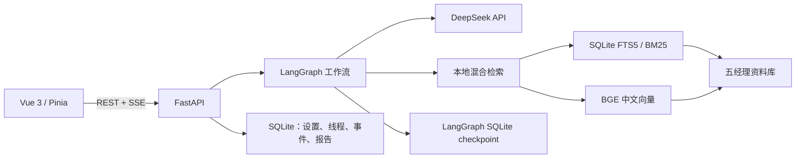

# Fund Insight

Fund Insight 是一个本机单用户的基金经理研究与讨论系统。它把五位基金经理的本地资料库、混合检索、LangGraph 多智能体工作流和 DeepSeek 模型接入到同一个 Vue Web 应用中。

系统支持三种讨论方式：

- **单人总结**：选择 1 位经理，基于其个人语料完成一次结构化回答。
- **多人总结**：选择 2–5 位经理并行独立分析，再由主持节点整理共识、分歧和证据边界。
- **会议讨论**：第一轮独立开场，第二轮阅读所有开场观点后交叉回应，最后生成主持报告；N 位经理共执行 `2N+1` 次模型调用。

所有模式都能在原线程继续追问。历史、发言、报告、引用、SSE 事件和 LangGraph checkpoint 会持久化，容器重启后仍可恢复。

> 本项目只用于研究和学习，不构成投资建议。界面头像是统一生成的虚构插画，不代表或还原经理真人形象。

## 五位基金经理

唯一注册表位于 [`config/managers.yaml`](config/managers.yaml)，前端卡片、后端检索、LangGraph 和辅助脚本均从这里读取经理信息。

| 经理 | 机构 | 研究标签 |
|---|---|---|
| 刘旭 | 大成基金 | 长期价值、制造业、安全边际 |
| 张坤 | 易方达基金 | 价值投资、高质量成长、长期持有 |
| 张璐 | 永赢基金 | 先进制造、机器人、产业趋势 |
| 谢治宇 | 兴证全球基金 | 自下而上、均衡配置、性价比 |
| 赵诣 | 泉果基金 | 高端制造、成长投资、竞争格局 |

每位经理的目录都使用同一结构：

```text
references/managers/{经理}/
├── profile.md
├── method.md
├── scorecard.md
├── corpus/
└── fund_data/
```

## 快速启动

要求：Docker Desktop 与 Docker Compose。

```powershell
Copy-Item .env.example .env
docker compose up --build
```

打开 [http://127.0.0.1:8080](http://127.0.0.1:8080)。服务默认只绑定本机，不包含注册登录或公网多租户功能。

首次启动后：

1. 打开“设置”，录入 DeepSeek API Key。
2. 点击“测试并刷新”，读取真实可用模型和余额。
3. 等待知识索引完成；首次构建需要下载 `BAAI/bge-small-zh-v1.5`，模型缓存会保存在 Docker volume。
4. 回到首页，选择模式、经理和主题并开始讨论。

如需显式设置应用加密密钥，先生成 Fernet key，再写入 `.env` 的 `APP_ENCRYPTION_KEY`：

```powershell
python -c "from cryptography.fernet import Fernet; print(Fernet.generate_key().decode())"
```

如果该变量留空，后端会在持久化数据卷中首次生成密钥。DeepSeek Key 只通过设置页提交，经认证加密后写入 SQLite；接口只返回掩码，浏览器不会持有已保存的明文密钥。

## 系统架构



### 检索与引用

- Markdown 按标题和约 800 个中文字符分块，重叠约 120 字；CSV、JSON 会转成带字段名的文本。
- 每个片段记录经理、资料类型、基金代码、报告期、源文件、标题和 SHA-256。
- FTS5 关键词结果与 `BAAI/bge-small-zh-v1.5` 向量结果使用 Reciprocal Rank Fusion 合并，最多返回 8 个片段。
- 重建按文件哈希增量更新。向量模型不可用时自动降级到关键词检索，应用仍可运行。
- 每位经理节点只能检索自己的资料。直接引语必须在对应片段中逐字匹配；推演统一标记为“基于方法论模拟”。

### LangGraph 工作流

多人模式通过动态 `Send` 并行分发经理节点，reducer 汇总结构化 `ManagerView`。会议第二轮会读取第一轮所有人的结构化观点，但仍只能引用发言经理自己的语料。单个经理调用失败时，其余分支继续执行，主持报告会标记缺席。

SSE 事件类型：

```text
run.started
manager.started
manager.delta
manager.completed
round.started
moderator.delta
run.completed
run.failed
```

事件会先写入 SQLite，再推送给浏览器。`Last-Event-ID` 和 `after` 参数支持断线续传。

## 页面

- **首页**：三种模式、五位经理卡片、搜索筛选、讨论预览和选择校验。
- **基金经理**：经理简介、方法标签、代表基金和语料统计。
- **历史对话**：按关键词和模式筛选、删除、打开并继续追问。
- **讨论详情**：“讨论过程 / 综合报告”双视图，直接证据可打开来源抽屉。
- **设置**：DeepSeek Key、连接测试、动态模型、真实余额、语言、总结格式、索引状态与重建。

桌面视觉基准为 1536×1024；平板会将工作区改为单列，手机会折叠左侧导航并纵向排列卡片。

## 本地开发

### 后端

推荐 Python 3.12：

```powershell
python -m venv .venv
.\.venv\Scripts\Activate.ps1
python -m pip install -r backend\requirements.txt
$env:FUND_INSIGHT_AUTO_INDEX="0"
uvicorn backend.app.main:app --reload --host 127.0.0.1 --port 8000
```

### 前端

```powershell
Set-Location frontend
npm install
npm run dev
```

Vite 会把 `/api` 代理到 `127.0.0.1:8000`。生产镜像由 Nginx 同源代理，因此不需要生产 CORS 配置。

## API

主要接口：

```text
GET    /api/managers
GET    /api/managers/{id}
GET    /api/settings
PATCH  /api/settings
PUT    /api/settings/deepseek-key
DELETE /api/settings/deepseek-key
POST   /api/settings/deepseek-test
POST   /api/index/rebuild
GET    /api/index/status
POST   /api/threads
GET    /api/threads
GET    /api/threads/{id}
DELETE /api/threads/{id}
POST   /api/threads/{id}/runs
GET    /api/runs/{id}
GET    /api/runs/{id}/events
POST   /api/runs/{id}/cancel
GET    /api/sources/{chunk_id}
GET    /api/health
```

启动后可在 [http://127.0.0.1:8000/docs](http://127.0.0.1:8000/docs) 查看开发环境 OpenAPI 文档。

## 测试

```powershell
python -m pytest backend\tests -q
Set-Location frontend
npm test
npm run build
```

现有测试覆盖经理注册表、SQLite 持久化、Key 加密与掩码、索引增量更新、混合检索降级、精确引用校验、三种 LangGraph 调用拓扑、API 选择规则和前端选择限制。

## 项目结构

```text
.
├── backend/                 # FastAPI、LangGraph、检索、持久化与测试
├── frontend/                # Vue 3、Pinia、SSE UI 与 Nginx 镜像
├── config/managers.yaml     # 唯一经理注册表
├── references/managers/     # 五位经理标准化知识库
├── scripts/                 # 本地检索、索引与基金数据辅助脚本
├── agents/openai.yaml       # Codex Skill 界面元数据
├── SKILL.md                 # 五经理研究 Skill 工作流
└── compose.yaml             # 本机双服务部署
```

## V1 范围

V1 不实现用户账号、收藏、自动联网更新、定时任务、实时行情或多用户配额。设置中的“重建索引”只读取当前 `references/`；现有资料删除和人工修改会被视为事实源，不会恢复已删除经理或旧重复目录。

## V2 新增

V2新增数据总结提示词功能
